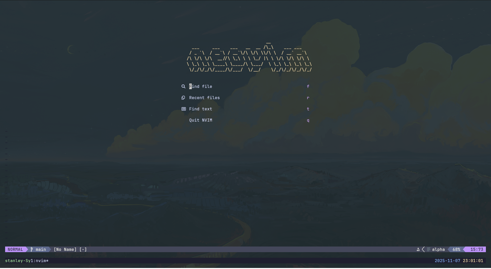

# Dotfiles

Reproducible Ubuntu development environment for Neovim, Kitty, and tmux. The
bootstrap installs pinned application and font versions, links the tracked
configuration into `$HOME`, and restores Neovim plugins and development tools.

<p align="center">
  
</p>

## Fresh Ubuntu Installation

```bash
sudo apt update && sudo apt install -y git
git clone https://github.com/stanleyavril123/dotfiles.git ~/.dotfiles
~/.dotfiles/install.sh
```

Restart Kitty after the installer completes. Then open Neovim and run
`:checkhealth` if you want to inspect the installed providers.

The installer is safe to run again. Existing files that are not already linked
to this repository are moved to timestamped backups before the links are made.

To install only the links without downloading packages or tools:

```bash
~/.dotfiles/install.sh --link-only
```

To install the editor and terminal setup without optional coding-agent CLIs:

```bash
~/.dotfiles/install.sh --no-agents
```

## Managed Setup

- Neovim 0.10.3 and its locked plugins
- Kitty 0.32.2 with transparency and the Adapta Nokto Maia theme
- Kitty windows start maximized through the tracked `~/.local/bin/kitty` launcher
- tmux with `Ctrl-a`, Vim navigation, copy mode, and system clipboard support
- JetBrainsMono Nerd Font 3.3.0
- Mason language servers and formatters
- Claude Code stable channel
- A terminal-first coding-agent workflow using tmux and Git
- Ubuntu command-line dependencies such as ripgrep, Node.js, Python, and build tools

Configuration is stored in the standard home-directory layout:

```text
~/.dotfiles/
├── .config/
│   ├── kitty/
│   ├── git/
│   └── nvim/
├── .tmux.conf
└── install.sh
```

The installer creates these links:

```text
~/.config/nvim  -> ~/.dotfiles/.config/nvim
~/.config/kitty -> ~/.dotfiles/.config/kitty
~/.config/git/ignore -> ~/.dotfiles/.config/git/ignore
~/.tmux.conf    -> ~/.dotfiles/.tmux.conf
~/.local/bin/kitty -> ~/.dotfiles/bin/kitty
```

## Updating

Edit the files through their normal paths, commit from `~/.dotfiles`, and push:

```bash
cd ~/.dotfiles
git add .
git commit -m "chore: update development environment"
git push
```

On another computer:

```bash
cd ~/.dotfiles
git pull
./install.sh
```

That is the normal sync loop: make a change on one computer, commit and push
it, then pull and rerun the installer on the other. The symlinks mean edits made
through `~/.config/nvim`, `~/.config/kitty`, or `~/.tmux.conf` are edits to this
repository and are ready to commit.

## What Stays Machine-local

The repository deliberately does not contain SSH keys, GitHub tokens, or Claude
credentials. Sign in to the required services once on each computer. Everything
else listed above is recreated by the installer.

## Neovim Workflow

Leader is `Space`.

| Mapping | Action |
| --- | --- |
| `<C-p>` / `<leader>sf` | Find files |
| `<leader>sg` | Live grep project |
| `<leader>xx` | Workspace diagnostics |
| `<leader>xb` | Buffer diagnostics |
| `<S-h>` / `<S-l>` | Previous or next buffer |
| `<leader>bp` | Pick a visible buffer |
| `<leader>bd` | Close buffer |
| `<C-n>` | Toggle file explorer |
| `<leader>gg` | Open Neogit |
| `<leader>gd` | Open Diffview |
| `<leader>mp` | Toggle rendered Markdown preview |

Use `:Mason`, `:ConformInfo`, `:OverseerRun`, and `:checkhealth` to inspect the
development tooling.

## Coding Agents

Coding agents run in a separate tmux pane while Neovim remains the editor and
Git provides the review boundary. From a project opened in Neovim:

1. Press `Ctrl-a v` to create a pane on the right.
2. Start `codex` or `claude` from the project root and give it a coherent task.
3. Move between the editor and agent with `Ctrl-h` and `Ctrl-l`.
4. After the agent finishes, use `[h` and `]h` to inspect changed hunks or
   `<leader>gd` to review the complete working-tree diff.
5. Use `<leader>gg` to stage, discard, and commit the reviewed changes.

Neovim checks for externally modified files when focus returns, so edits made by
the agent are reloaded without an agent-specific preview plugin. Commit before a
large task when an easy rollback point is useful.

## tmux Workflow

`Ctrl-a` is the prefix. Use `Ctrl-a [` to enter Vim-style copy mode, `v` to
select, `y` or `Enter` to copy, and `Ctrl-a ]` to paste. Prefix followed by
`h`, `j`, `k`, or `l` changes panes.

## License

MIT - see [LICENSE](LICENSE).
